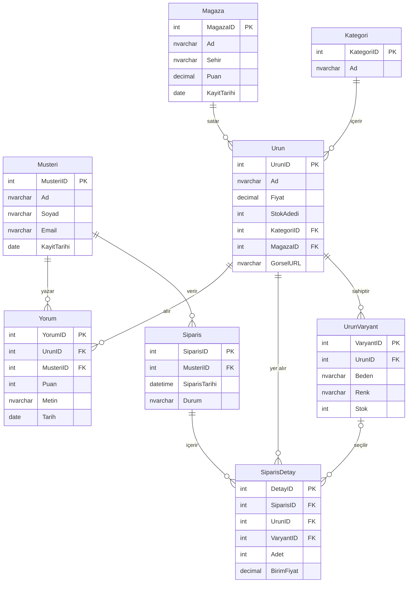

# miyshop — E-Ticaret Veritabanı Sistemi

**GrupNo: 133** 241307022 Mustafa Yiğit Genç — 241307056 İbrahim Akkuş  
**Ders:** Veritabanı Yönetim Sistemleri (2025-2026 Bahar)  
**Geliştirme Ortamı:** Microsoft SQL Server 2022 + SSMS + Python 3.12 + Flask 3.1

---

## Problem Tanımı

Bir e-ticaret platformunun temel iş süreçlerini yönetecek ilişkisel bir veritabanı sistemi tasarlanmıştır. Çözülmesi gereken başlıca problemler:

- Müşteri, ürün ve sipariş verilerinin veri tekrarı olmadan tutulması
- Bir siparişin birden fazla ürün içerebilmesi (çoka-çok ilişki)
- Sipariş verildiğinde stok adedinin **otomatik** güncellenmesi
- İptal durumunda stoğun **otomatik** iade edilmesi
- Ürünlerin beden/renk gibi varyantlarının ayrı stok ile yönetilmesi
- Kategoriye göre satış raporu, kritik stok uyarısı ve müşteri bazlı sipariş geçmişi sorgularının verimli çalışması
- -Müşteri deneyimini şeffaf şekilde yansıtmak amacıyla ürünlere derecelendirmeli (1-5 puan) yorum yapılabilmesi ve bu verilerin sipariş geçmişiyle ilişkili tutulması.

---

## Yapılan Araştırmalar

- **Çoka-çok ilişki çözümü:** Bir siparişte birden fazla ürün, bir ürünün birden fazla siparişte yer alması N:N ilişki doğuruyordu. `SiparisDetay` ara tablosu oluşturularak 3NF'e uygun hale getirildi [1].
- **Trigger çoklu satır sorunu:** İlk denemede trigger tek satır varsayımıyla yazıldığında toplu INSERT işlemlerinde hatalı stok güncellemesi gözlemlendi. `inserted` sanal tablosu + `JOIN` kullanılarak düzeltildi [2].
- **İptal trigger tekrar tetiklenme:** Zaten iptal olan siparişin güncellenmesinde stoğun tekrar artırılması engellendi; `inserted` (yeni hal) ve `deleted` (eski hal) karşılaştırması kullanıldı [2].
- **SCOPE_IDENTITY() tercih sebebi:** `OUTPUT INSERTED` ifadesi, tetikleyicisi olan tablolarda SQL Server tarafından kısıtlandığından yeni sipariş ID'si `SET NOCOUNT ON; INSERT; SELECT SCOPE_IDENTITY()` kalıbıyla alındı [3].
- **Varyant–stok tasarımı:** Ürün bazlı genel stok ile varyant bazlı detay stok birlikte tutuldu; `SiparisDetay` tablosuna `VaryantID` (nullable FK) eklenerek her iki katman trigger içinde güncelleniyor.
- **pyodbc stored procedure çağrısı:** Procedure sonrasında kalan result set'lerin `cursor.nextset()` ile temizlenmesi gerektiği test aşamasında tespit edilerek düzeltildi [4].

---

## Akış Şeması

```mermaid
flowchart TD
    A([Kullanıcı]) --> B[Ürün Listeleme\nKategori Filtresi / Arama]
    B --> C{Üründe Varyant\nTanımlı mı?}
    C -- Evet --> D[Varyant Seçimi\nBeden / Renk / Tür]
    C -- Hayır --> E[Adet Girişi]
    D --> E
    E --> F{Stok\nYeterli mi?}
    F -- Hayır --> G[Hata Mesajı\nYetersiz Stok]
    F -- Evet --> H[INSERT INTO Siparis]
    H --> I[INSERT INTO SiparisDetay]
    I --> J[[Trigger: trg_StokDus]]
    J --> K

---

## Yazılım Mimarisi

```
miyshop/
├── app.py                  — Flask backend; route tanımları, DB sorguları, iş mantığı
└── templates/
    ├── base.html           — Ortak layout (sidebar, topbar, CSS değişkenleri, dark mode)
    ├── index.html          — Dashboard (özet istatistikler)
    ├── urunler.html        — Ürün kartları + kategori filtresi + silme
    ├── urun_ekle.html      — Yeni ürün ekleme formu
    ├── siparis_ekle.html   — Sipariş formu (JS ile dinamik varyant seçimi)
    ├── siparis_ozeti.html  — Sipariş listesi (durum filtresi + ilerletme)
    ├── siparis_detay.html  — Sipariş detayı (sp_SepetToplami çıktısı)
    ├── musteriler.html     — Müşteri listesi (harcama sıralaması)
    ├── musteri_detay.html  — sp_MusteriOzet çıktısı
    ├── magazalar.html      — Mağaza kartları (tıklanınca detay)
    ├── magaza_detay.html   — Mağaza ürünleri + yorum istatistikleri
    ├── yorumlar.html       — Yorum listesi
    ├── yorum_ekle.html     — Yorum ekleme formu
    ├── raporlar.html       — sp_SatisRaporu + vw_SatisDetaylari görünümü
    ├── kritik_stok.html    — vw_KritikStok görünümü
    └── arama.html          — Ürün / müşteri arama sonuçları
```

**Katmanlar:**

| Katman | Teknoloji | Görev |
|--------|-----------|-------|
| Veri | SQL Server 2022 | 8 tablo, 6 index, 2 trigger, 3 procedure, 3 view |
| Backend | Python 3.12 + Flask 3.1 | Route yönetimi, pyodbc ile DB erişimi |
| Frontend | Jinja2 + HTML5/CSS3 | CSS değişkenleri tabanlı light/dark tema |

---

## Veritabanı Diyagramı


### Tablo İlişkileri

#### Bire-Çok (1:N) İlişkiler

| İlişki | Açıklama |
|--------|----------|
| `Kategori` → `Urun` | Bir kategori birden fazla ürünü kapsar; bir ürün yalnızca tek bir kategoride yer alır. `Urun.KategoriID` FK ile sağlanır. |
| `Magaza` → `Urun` | Bir mağaza birden fazla ürün satar; her ürün tek bir mağazaya aittir. `Urun.MagazaID` FK ile sağlanır. |
| `Urun` → `UrunVaryant` | Bir ürünün birden fazla varyantı (beden/renk) olabilir; her varyant yalnızca bir ürüne aittir. |
| `Musteri` → `Siparis` | Bir müşterinin birden fazla siparişi olabilir; her sipariş tek bir müşteriye aittir. `Siparis.MusteriID` FK ile sağlanır. |
| `Siparis` → `SiparisDetay` | Bir sipariş birden fazla kalem içerebilir; her kalem tek bir siparişe aittir. |
| `Urun` → `Yorum` | Bir ürün birden fazla yorum alabilir; her yorum tek bir ürüne aittir. |
| `Musteri` → `Yorum` | Bir müşteri birden fazla yorum yazabilir; her yorum tek bir müşteriye aittir. |

#### Çoka-Çok (N:N) İlişki ve Çözümü

**Sipariş ↔ Ürün** ilişkisi doğası gereği çoka-çoktur:
- Bir sipariş → birden fazla ürün içerebilir
---

## Genel Yapı

- **8 tablo** — 5NF uyumlu; kısmi ve geçişli bağımlılıklar giderilmiştir
- **6 index** — sık JOIN'lenen FK kolonlarında (KategoriID, MagazaID, MusteriID, SiparisID, UrunID × Yorum)
- **2 trigger** — `trg_StokDus` (sipariş → stok düşer) / `trg_IptalStokGeri` (iptal → stok iade)
- **3 stored procedure** — `sp_SepetToplami`, `sp_MusteriOzet`, `sp_SatisRaporu`
- **3 view** — `vw_SiparisOzeti`, `vw_KritikStok`, `vw_SatisDetaylari`
- **30 ürün**, **10 müşteri**, **10 mağaza**, **27 varyant** test verisi
- **Flask web arayüzü** — ürün/sipariş/yorum CRUD, durum takibi, raporlama, arama, dark mode

### Kurulum

```bash
pip install flask pyodbc
```

1. SSMS'te `eticaret_sql_betikleri.sql` dosyasını baştan sona çalıştırın (CREATE DATABASE dahil)
2. `eticaret/` klasöründe `python app.py` çalıştırın
3. Tarayıcıda `http://127.0.0.1:5000` adresini açın

---

## Referanslar

[1] Microsoft Learn. *CREATE TRIGGER (Transact-SQL)*. https://learn.microsoft.com/en-us/sql/t-sql/statements/create-trigger-transact-sql

[2] Microsoft Learn. *Use the inserted and deleted Tables*. https://learn.microsoft.com/en-us/sql/relational-databases/triggers/use-the-inserted-and-deleted-tables

[3] Microsoft Learn. *SCOPE_IDENTITY (Transact-SQL)*. https://learn.microsoft.com/en-us/sql/t-sql/functions/scope-identity-transact-sql

[4] pyodbc Wiki. *Calling Stored Procedures*. https://github.com/mkleehammer/pyodbc/wiki/Calling-Stored-Procedures

[5] Microsoft Learn. *CREATE INDEX (Transact-SQL)*. https://learn.microsoft.com/en-us/sql/t-sql/statements/create-index-transact-sql

[6] W3Schools. *SQL Tutorial*. https://www.w3schools.com/sql/

[7] Flask Documentation. *Quickstart*. https://flask.palletsprojects.com/en/stable/quickstart/

[8] Codd, E. F. (1970). *A Relational Model of Data for Large Shared Data Banks*. Communications of the ACM, 13(6), 377–387.

[9] Yapay Zeka Araçları (Chatgpt, Gemini, Claude).
